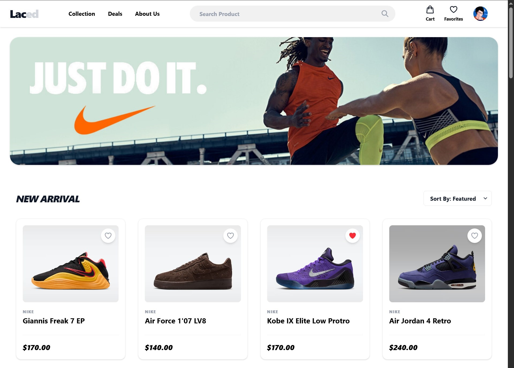

# ShoeStore Group

A small full-stack e-commerce project (FastAPI backend + Vite/React frontend) used for group development and learning.

## Project structure (top-level)
- `backend/` — FastAPI app, database models, migrations
- `frontend/` — Vite + React app

## Quick start

Backend

```bash
cd backend
pip install -r requirements.txt
uvicorn main:app --reload
```

Frontend

```bash
cd frontend
npm install
npm run dev
```

## Environment
- Backend: Python 3.10+ (see `backend/requirements.txt`)
- Frontend: Node 16+ (Vite + React)

## Preview

```md

```


